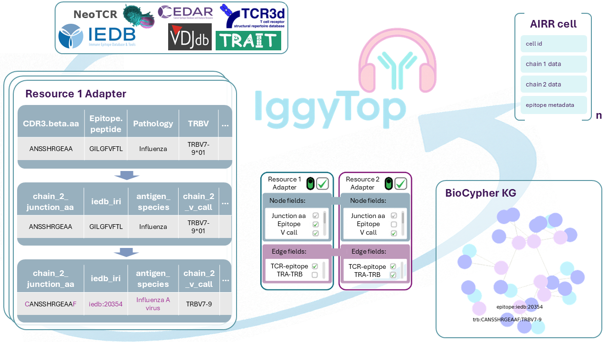

# IggyTop: **I**mmunolo**g**ical **G**raph **Y**ielding **Top** receptor-epitope pairings

[](https://www.python.org/downloads/)
[](LICENSE)



This repository uses [BioCypher](https://biocypher.org) framework for harmonization of databases with existing immunoreceptor-epitope matching information.

BioCypher is designed to facilitate the standardized integration of heterogeneous data sources through a regulated framework. The BioCypher framework implements a modular architecture where each data source is processed through dedicated transformation scripts called adapters. These adapters serve as the primary interface between raw data sources and the BioCypher knowledge graph infrastructure. This project provides adapters for the following databases:

- [IEDB](https://www.iedb.org/)
- [VDJdb](https://github.com/antigenomics/vdjdb-db)
- [McPAS-TCR](https://friedmanlab.weizmann.ac.il/McPAS-TCR/)
- [CEDAR](https://cedar.iedb.org/home_v3.php)
- [ITRAP](https://github.com/mnielLab/ITRAP_benchmark/blob/main/ITRAP.csv) (data filtered from [10X Genomics Dataset](https://www.10xgenomics.com/library/a14cde))
- [TRAIT](https://pgx.zju.edu.cn/traitdb/)
- [TCR3d](https://tcr3d.ibbr.umd.edu/)
- [NeoTCR](https://github.com/lyotvincent/NeoTCR?tab=readme-ov-file)

These include data from both, original sources, extracting data directly from studies, such es McPAS-TCR, and from already pulled sources such as TRAIT.
A script is provided to build a knowledge graph with all these adapters. On a consumer laptop, building the full graph typically takes 20-30 mins.

The final output is the **IggyTop** database, which integrates immunoreceptor-epitope matching information from all supported data sources.

## Graphs vs Tables
Two paths are covered: A tabular path, stacking the source databases and returning them in tabular format, and a knowledge graph path, converting the source data into a graph. We cover both paths extensively in the [documentation](https://iggytop.readthedocs.io/en/latest/). For more details on the graph data structure, see [Graph Data Structure](https://iggytop.readthedocs.io/en/latest/graph_data_structure.html). For the tabular approach, refer to [Tabular Data Structure](https://iggytop.readthedocs.io/en/latest/tabular_data_structure.html).

## Prerequisites

- [uv](https://docs.astral.sh/uv/): for dependency management
- [docker](https://www.docker.com/get-started/): optional for neo4j (see below)

## Installation

1. Clone the repository:
   ```bash
   git clone https://github.com/biocypher/iggytop.git
   cd iggytop
   ```

2. Install dependencies using uv:
   ```bash
   # Core installation (includes dev dependencies)
   uv sync

   # Include documentation and Jupyter tools
   uv sync --group docs
   ```

3. You are ready to go!
   ```bash
   uv run create_knowledge_graph.py
   ```
   or

   ```bash
   uv run create_anndata.py
   ```
More information can be found in the [documentation](https://iggytop.readthedocs.io/en/latest/).

## Pipeline

- `create_knowledge_graph.py`: the main script that orchestrates the pipeline.
It brings together the BioCypher package with the data sources. It calls the `io.create_knowledge_graph()` function which creates a knowledge graph including all available databases and saves it to airr format in a json file. use the `--adapters` flag to select single source databases
```bash
uv run create_knowledge_graph.py --adapters VDJDB CEDAR --filter-10x
```
- `create_anndata.py`: this script can be used to obtain the harmonized, merged (and deduplicated) data from all (or selected) available databases in [anndata](https://anndata.readthedocs.io/en/stable/index.html) format.
It will initialize the adapters but not generate the knowledge graph. The main purpose is integration of the available data into [Scirpy](https://scirpy.scverse.org/en/latest/). You can specify which adapters to include:
```bash
uv run create_anndata.py --adapters VDJDB CEDAR --filter-10x
```
- `src/iggytop/adapters` contains modules that define the adapter to the data source.

- `src/iggytop/config/schema_config.yaml`: a configuration file
that defines the schema of the knowledge graph. It is used by BioCypher to map
the data source to the knowledge representation on the basis of ontology (see
[this part of the BioCypher tutorial](https://biocypher.org/tutorial-ontology.html)).

- `src/iggytop/config/biocypher_config.yaml`: a configuration file that defines some BioCypher parameters, such as the mode, the
separators used, and other options. More on its use can be found in the
[Documentation](https://biocypher.org/BioCypher/reference/biocypher-config/).

## Documentation
We use [Sphinx](https://www.sphinx-doc.org/en/master/) for documentation, see (`./docs`).
The full documentation is available online via [Read the Docs](https://iggytop.readthedocs.io/en/latest/).
It the documentation is updated upon commits (pr's) or manually, note that this can mean that the [database summary](https://iggytop.readthedocs.io/en/latest/notebooks/database_summary.html) was not built on the [latest release](https://github.com/biocypher/iggytop/releases/latest)

## Testing and CI/CD

IggyTop uses GitHub Actions to automate **bimonthly data releases** and ensure data integrity through continuous integration.
Currently this only involves the tabular part of Iggytop (`create_anndata.py`)
Check out the latest release [here](https://github.com/biocypher/iggytop/releases/latest)
### Bimonthly Data Releases
- **Frequency**: Automated releases on the **1st day of every 2nd month**. (first scheduled on **May 1,2026**)
- **Release Assets**:
   Check out the release notes for more information on the released datasets.

### Automated Testing
Before any data is released, the CI pipeline (based on Github Actions) runs a validation suite to catch breaking changes in upstream databases.

**How to run tests locally:**
```bash
uv run pytest tests/
```
**How to test the CI pipelines**
Ensure you have Docker and `act` installed, then run:
```bash
# Run the workflow
act workflow_dispatch -W .github/workflows/ci_ingestion.yml
```

## Graph visualization using Neo4j on Docker

This repo also contains a `docker compose` workflow to create the example
database using BioCypher and load it into a dockerised Neo4j instance
automatically. To run it, simply execute
```
docker compose up -d --build
```
in the root directory of the project. The example instance consists of the TCR3d database only as it is small enough to visualize, for other database compositions, just edit the `create_knowledge_graph_docker.py` script to your needs. This will start up a single (detached) docker
container with a Neo4j instance that contains the knowledge graph built by
BioCypher as the DB `docker`, which you can connect to and browse at
localhost:7474. Authentication is set to `neo4j/neo4jpassword` by default
and can be modified in the `docker_variables.env` file.

Open http://localhost:7474 to access the neo4j database. You can now run queries against the database.
To get a visual representation of the tcr3d knowledge grraph constructed by iggytop, run the following CYPHER query:
```
MATCH (n) return n
```

The `biocypher_docker_config.yaml` file is used instead of the
`biocypher_config.yaml`. Everything else is the same as in the local setup. The
first container installs and runs the BioCypher pipeline, and the second
container installs and runs Neo4j. The files created by BioCypher in the first
container are copied and automatically imported into the DB in the second
container.


## Related work:
If you find a dataset (eg training data for a model) and would like to find the source of the records using the IggyTop dataset, check out [this tool](https://github.com/RaphaelDeGottardi/TCR_source_detection).

This project is built on (and part of) the [BioCypher](https://github.com/biocypher/biocypher) framework. Make sure to check out this cool project!


## Contributing

Contributions are welcome! Please feel free to submit a Pull Request or create
an Issue if you discover any problems.

## License

This project is licensed under the MIT License - see the LICENSE file for
details.
